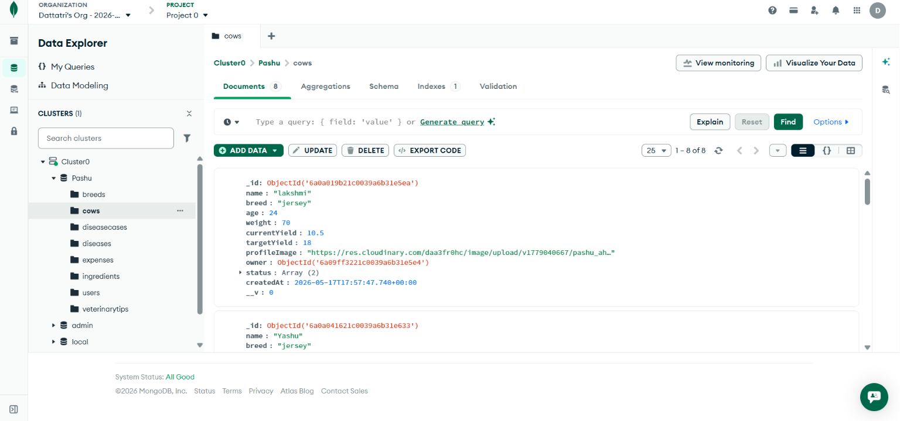
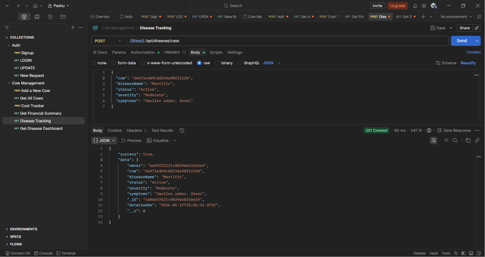
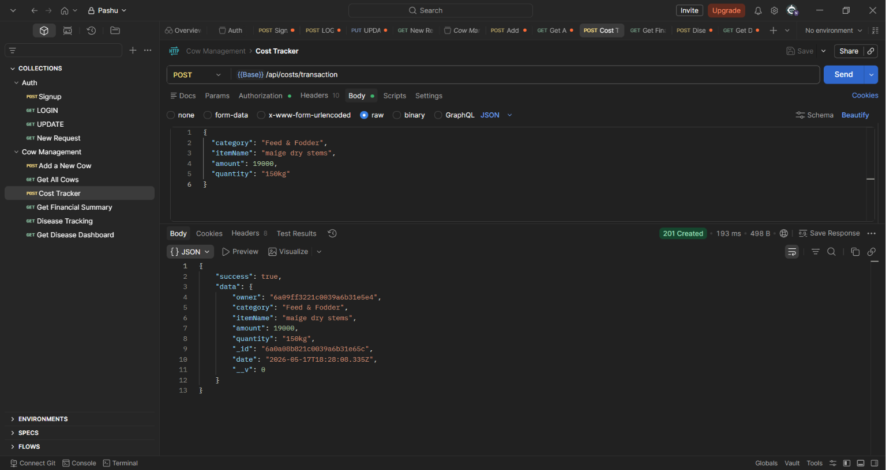
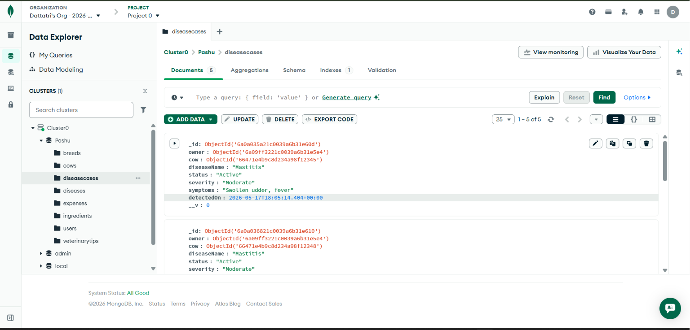
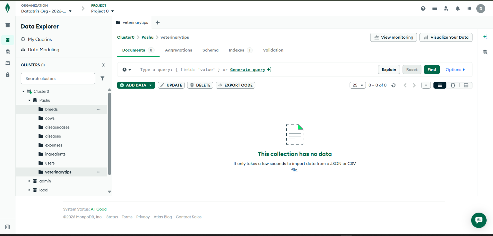
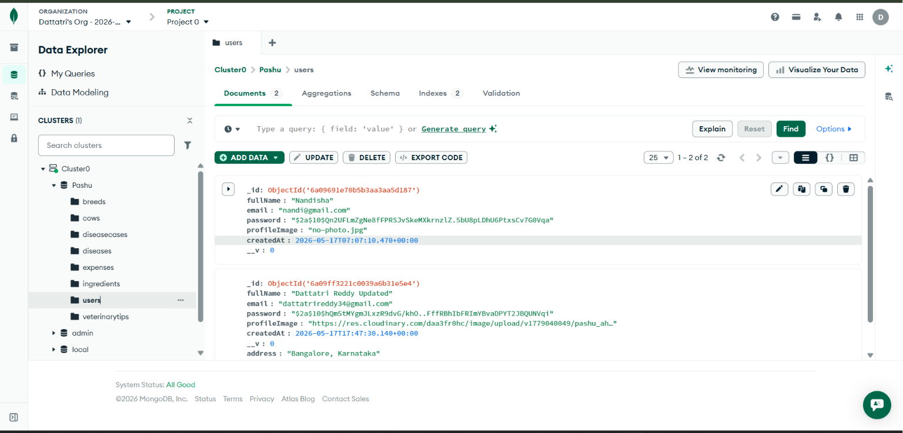
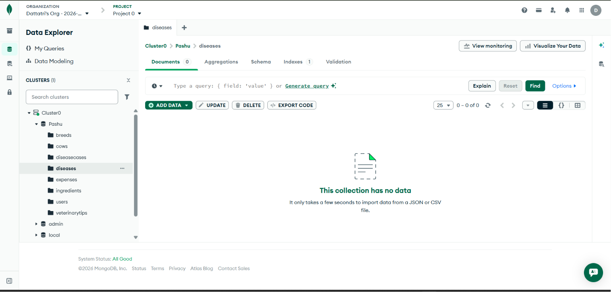

# Pashu-Aahar (Smart Nutrition for Your Herd)

Pashu-Aahar is a comprehensive dairy management platform designed to empower farmers with data-driven insights. It consists of an Android application built with Jetpack Compose and a robust Node.js/Express backend.

## 🚀 Features

- **My Herd Dashboard**: Real-time stats on total cows, yield, efficiency, and health.
- **Disease Tracking**: Monitor active cases, treatments, and recovery status with severity indicators.
- **Cost Tracker**: Log expenses and income with dynamic charts and cow-wise analysis.
- **Multi-step Add Cow**: Seamless flow to create cow profiles with breed and body details.
- **Profile Management**: Update personal info, change passwords, and access veterinary tips.
- **Cloud Integration**: Profile images stored securely on Cloudinary.

---

## 📸 Screenshots

### App UI
<p align="center">
  
  
  
</p>
<p align="center">
  
  
</p>

### API Documentation (Postman)
#### Authentication
- **Signup**: `screenshots/Signup.png`
- **Login**: `screenshots/Login.png`
- **Update Profile**: `screenshots/update.png`

#### Cow Management
- **Add a New Cow**: `screenshots/addnewcow.png`
- **Get All Cows**: `screenshots/getallcows.png`

#### Cost & Health
- **Add Transaction**: `screenshots/expensesdb.png`
- **Financial Summary**: `screenshots/financialsummury.png`
- **Disease Dashboard**: `screenshots/diseasedashboard.png`

### Database (MongoDB)
<p align="center">
  
  
</p>

---

## 🛠️ Prerequisites

Before you begin, ensure you have the following installed:
- **Java JDK 17 or higher**
- **Android Studio** (Ladybug or newer recommended)
- **Node.js** (v18.0 or higher)
- **npm** (comes with Node.js)
- **Git**

---

## 📂 Installation & Setup

### 1. Clone the Repository
```bash
git clone git@github.com:Nandisha-code/Pashu_Ahar.git
cd Pashu_Ahar
```

### 2. Backend Setup
1. Navigate to the backend directory:
   ```bash
   cd backend
   ```
2. Install dependencies:
   ```bash
   npm install --legacy-peer-deps
   ```
3. Create a `.env` file in the `backend` folder and add your credentials:
   ```env
   PORT=3000
   MONGO_URI=your_mongodb_connection_string
   JWT_SECRET=your_jwt_secret
   JWT_EXPIRE=30d
   CLOUDINARY_CLOUD_NAME=your_cloud_name
   CLOUDINARY_API_KEY=your_api_key
   CLOUDINARY_API_SECRET=your_api_secret
   ```
4. (Optional) Seed the database with sample data:
   ```bash
   node seed.js
   ```
5. Start the server:
   ```bash
   npm start
   ```

### 3. Frontend Setup (Android)
1. Open the project root folder in **Android Studio**.
2. Wait for **Gradle Sync** to finish.
3. If running on an **Emulator**, the base URL is already configured to `http://10.0.2.2:3000`.
4. If running on a **Physical Device**, change the `BASE_URL` in `app/src/main/java/com/example/pashu_ahar/api/ApiService.kt` to your computer's local IP address (e.g., `http://192.168.x.x:3000`).

---

## 🏃 Running the App

1. Ensure the Node.js backend is running.
2. In Android Studio, select your device/emulator and click the **Run** button (green play icon).

---

## 📝 License
This project is for educational and management purposes for dairy farmers.
